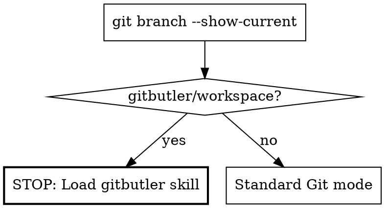

# Commit

Analyze uncommitted changes, organize them into logical commits with conventional commit messages, and optionally execute. Automatically detects and adapts to GitButler workspace mode.

**Repo Context:** Read `scopes.md` in this skill's directory for repo-specific scope conventions and commit rules. Also check the project's root `CLAUDE.md` or `AGENTS.md` for additional conventions.

**NEVER add the AI agent as a co-author in commit messages. No `Co-Authored-By` lines.**

## Step 1: Detect Git Environment

**Do this FIRST, before anything else.**

```bash
git branch --show-current
```



**CRITICAL: If on `gitbutler/workspace`, you MUST read the `gitbutler` skill before proceeding. Do NOT attempt GitButler commands without it. This is a BLOCKING requirement — stop and load that skill now.**

**If standard Git mode:** Continue with `git` commands as described below.

## Step 2: Examine Changes

```bash
git status
git diff
git diff --cached
```

Understand the full scope — what was added, modified, deleted, and why.

## Step 3: Group into Logical Commits

Analyze the changes and organize them into cohesive commits. Each commit should be:

- **Atomic**: A single logical unit of work that could be safely reverted independently
- **Complete**: All related changes together (don't split a feature across commits)
- **Focused**: One concern per commit

**Grouping principles:**
- Group related functionality together
- Separate features from bug fixes
- Keep refactoring separate from new features
- Isolate substantial documentation changes
- Configuration/build changes get their own commit if significant

## Step 4: Present Commit Plan & Get Approval

### Analyze-Only Mode

If the user asked to **analyze** or **organize** changes (not commit), present the plan and stop. Do not proceed to execution unless explicitly asked.

### Pre-Approval Detection

Check if your spawn prompt includes the phrase **"User has pre-approved committing"**.

- **If pre-approved:** Display the organized commit list (so the caller sees what you did), then proceed directly to Step 5 — do NOT use `AskUserQuestion`.
- **If NOT pre-approved (default):** Use `AskUserQuestion` with radio buttons as described below.

### Presenting the Plan

Display a numbered list of proposed commits showing **only the commit message** (summary + body). Keep it scannable — no file lists in the presentation.

Example:

```
Organized into 3 commits:

1. feat(api): added endpoints for retrieving user documents
   - Added GET and POST handlers with input validation
   - Included pagination and filtering support

2. feat(ui): created document list with search and filtering
   - Built reusable list component with status indicators
   - Added search input with debounced query

3. fix(web): corrected redirect logic for unauthenticated users
   - Fixed race condition in auth state check
   - Added fallback route for expired sessions
```

### Getting Approval

Use `AskUserQuestion` with these options:

| Option | Label | Description |
|--------|-------|-------------|
| 1 (Recommended) | Execute all commits | Commit all {N} changes as organized above |
| 2 | Re-organize | Tell me what to change and I'll re-group the commits |
| 3 | Cancel | Abort without committing |

**If user chooses "Re-organize":** Ask what they'd like changed, re-group, and present the plan again.
**If user chooses "Cancel":** Stop — do not commit anything.

## Step 5: Execute Commits

For each commit in the approved plan:

```bash
git add {file1} {file2}
git commit -m "$(cat <<'EOF'
{commit message}
EOF
)"
```

**If in GitButler mode:** Follow the execution instructions from the gitbutler skill instead.

### Amending Fixes into Existing Commits (GitButler)

When amending changes into existing commits (e.g., after code review
fixes), use `absorb` with a dry-run first, then fall back to `rub`
for anything it gets wrong:

1. `but absorb --dry-run --json` — preview where changes would go
2. If all placements are correct → `but absorb --json --status-after`
3. If some are misplaced → `but rub <file-id> <commit-id>` for those
4. After each `rub`, refresh IDs with `but status --json` (they shift)

**When to use which:**
- `but absorb` — smart auto-detect based on code dependencies. Best
  for small fixes where the target commit is obvious from the diff.
- `but rub <file> <commit>` — explicit manual control. Use when you
  know exactly where each change belongs, or when absorb guesses wrong.
- `but absorb --dry-run` first is always the safe starting point.

## Step 6: Optional Push

After all commits are done, ask:

> Commits done. Want me to push?

Only push if the user explicitly approves.

---

## Commit Message Format

Follow the project's conventions from CLAUDE.md. Default format:

### Structure

```
{type}({scope}): {summary in past tense}

{1-2 sentence intent paragraph explaining why this change was made}

- {change 1}
- {change 2}
```

The intent paragraph is **required** and must come before bullets.
It should answer: "Why was this needed?" (problem/risk/outcome),
not just what files or code were changed.

### Rules

- **Type**: `feat`, `fix`, `docs`, `style`, `refactor`, `test`, `chore`
- **Scope**: Package folder name or app name in lowercase
- **Summary**: Must be 72 characters or fewer, past tense, first letter after scope is lowercase
- **Summary length is strict**: If over 72 chars, rewrite until it is <= 72 chars
- **Body paragraph first**: Start body with a short intent paragraph (1-2 sentences) explaining why the change was made
- **Why is mandatory**: First body sentence must state the motivation/impact, not implementation details
- **Body bullets after paragraph**: Follow intent paragraph with bullet points for concrete technical changes
- **Body line length**: Keep lines under 80 characters
- **Tense**: Always past tense ("added", "fixed", "updated" — not "add", "fix", "update")
- **No fluff**: Avoid "this commit" or "this change". No file paths in messages.
- **Issue references**: Reference issue numbers in body when applicable

### Examples

```
feat(web): added user profile settings page

Improved profile management UX so users can update personal details
without leaving the settings flow.

- Implemented form with validation for updating user details
- Added success and error toast notifications
```

```
fix(api): resolved incorrect error status on validation failure

Made API validation failures predictable for clients and monitoring by
returning the correct status family.

- Returned 400 instead of 500 for malformed request body
- Added descriptive error messages for each field
```

---

## Common Mistakes

| Mistake | Fix |
|---------|-----|
| One giant commit for unrelated changes | Split into logical atomic commits |
| Present tense in commit messages | Always past tense: "added" not "add" |
| Pushing without permission | Never push unless the user explicitly approves |
| Showing file lists in the plan | Only show commit messages (summary + body) — keep it scannable |
| Skipping commits in sub-agent mode | Even with pre-approval, still EXECUTE the commits — pre-approval skips the question, not the work |
| Committing without presenting the plan | Always show the commit list. Use AskUserQuestion unless pre-approved |
| No intent in body | Add a short 1-2 sentence intent paragraph before bullets |
| Commit title over 72 chars | Rewrite title to <=72 chars before committing |
